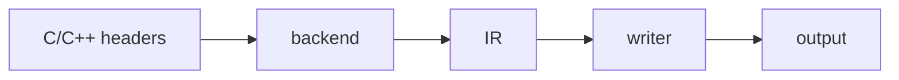

# headerkit

[](https://github.com/axiomantic/headerkit/actions/workflows/ci.yml)
[](https://axiomantic.github.io/headerkit/)
[](https://pypi.org/project/headerkit/)
[](https://pypi.org/project/headerkit/)
[](https://github.com/axiomantic/headerkit/blob/main/LICENSE)

**headerkit**: A CLI tool and Python library for parsing C/C++ headers.

Generates:

- **Bindings**: ctypes modules, CFFI definitions, Cython `.pxd` files, and LuaJIT FFI.
- **Data**: JSON Intermediate Representation (IR) and API diffs.
- **LLMs**: Token-optimized header summaries for prompt windows.
- **Builds**: PEP 517 backend for standard Python packaging.

Parse once. Build anywhere.

### Quick examples

Every example below assumes this input header:

```c
// mylib.h
typedef struct { int x, y; } Point;
int distance(const Point *a, const Point *b);
```

**ctypes -- drop-in Python module, no build step:**
```bash
headerkit mylib.h -w ctypes:bindings.py
```
```python
# generated bindings.py
class Point(ctypes.Structure):
    _fields_ = [
        ("x", ctypes.c_int),
        ("y", ctypes.c_int),
    ]

_lib.distance.argtypes = [ctypes.POINTER(Point), ctypes.POINTER(Point)]
_lib.distance.restype = ctypes.c_int
```

**CFFI -- declarations for `ffibuilder.cdef()`:**
```bash
headerkit mylib.h -w cffi:_defs.py
```
```c
/* generated  _defs.py */
typedef struct Point {
    int x;
    int y;
} Point;
int distance(const Point *a, const Point *b);
```

**Cython -- `.pxd` for compiled C/C++ interop:**
```bash
headerkit mylib.h -w cython:mylib.pxd
```
```cython
# generated mylib.pxd
cdef extern from "mylib.h":

    ctypedef struct Point:
        int x
        int y

    int distance(const Point *a, const Point *b)
```

**LuaJIT FFI -- `ffi.cdef` bindings for LuaJIT:**
```bash
headerkit mylib.h -w lua:mylib_ffi.lua
```
```lua
/* generated mylib_ffi.lua */
local ffi = require("ffi")

ffi.cdef[[

/* Structs */
typedef struct {
    int x;
    int y;
} Point;

/* Functions */
int distance(const Point *a, const Point *b);

]]
```

**JSON -- full IR for custom tooling:**
```bash
headerkit mylib.h -w json:mylib.json
```
```json
{
  "path": "mylib.h",
  "declarations": [
    {"kind": "struct", "name": "Point", "fields": [
      {"name": "x", "type": {"kind": "ctype", "name": "int"}},
      {"name": "y", "type": {"kind": "ctype", "name": "int"}}
    ]},
    {"kind": "function", "name": "distance", ...}
  ]
}
```

**Prompt -- token-optimized summary for LLM context windows:**
```bash
headerkit mylib.h -w prompt
```
```
// mylib.h (headerkit compact)
STRUCT Point {x:int, y:int}
FUNC distance(a:const Point*, b:const Point*) -> int
```

**Diff -- API compatibility reports between header versions:**
```python
from headerkit.backends import get_backend
from headerkit.writers.diff import DiffWriter

backend = get_backend("libclang")
old = backend.parse('#include "mylib_v1.h"', "v1.h")
new = backend.parse('#include "mylib_v2.h"', "v2.h")
print(DiffWriter(baseline=old, format="markdown").write(new))
```
```markdown
## Breaking Changes
### function_signature_changed
- **distance**: parameter 0 type changed from 'const Point *' to 'const Point3D *'
```

**Build backend -- generate cacheable bindings at `pip install` time:**
```toml
# In your project's pyproject.toml:
[build-system]
requires = ["headerkit", "hatchling"]
build-backend = "headerkit.build_backend"
```

**Python API -- parse and generate from code:**
```python
from headerkit import generate

output = generate("mylib.h", "cffi")
```



## Features

- **One parse, many outputs**: generate multiple bindings in a single pass with `-w ctypes:lib.py -w cython:lib.pxd`
- **Config file support**: `.headerkit.toml` or `[tool.headerkit]` in `pyproject.toml`
- **Multi-header merging**: pass multiple `.h` files and they are merged into a single umbrella header

## Installation

```bash
pip install headerkit
```

Requires Python 3.10+.

Then install libclang (if not already present):

```bash
headerkit install-libclang
```

Or install it manually:

| Platform | Command |
|----------|---------|
| macOS | `brew install llvm` or Xcode Command Line Tools |
| Ubuntu | `sudo apt install libclang-dev` |
| Fedora | `sudo dnf install clang-devel` |
| Windows | `winget install LLVM.LLVM` or [LLVM installer](https://github.com/llvm/llvm-project/releases) |

Supports LLVM 18, 19, 20, and 21.

## CLI reference

```
headerkit [options] FILE [FILE ...]
```

### Flags

| Flag | Description |
|------|-------------|
| `-b NAME`, `--backend NAME` | Parser backend (default: `libclang`) |
| `-I DIR` | Add include directory (repeatable) |
| `-D MACRO[=VALUE]` | Define preprocessor macro (repeatable) |
| `--backend-arg ARG` | Pass extra argument to the backend (repeatable) |
| `-w WRITER[:FILE]` | Write output to a file, or omit `:FILE` for stdout (repeatable) |
| `--writer-opt WRITER:KEY=VALUE` | Pass an option to a writer (repeatable) |
| `--config PATH` | Load config from `PATH` instead of searching |
| `--no-config` | Skip all config file loading |
| `--version` | Print version and exit |

At most one `-w` flag may omit the output path. Multiple writers sending to stdout is an error.

### Writers

| Writer | Output | Notes |
|--------|--------|-------|
| `cffi` | CFFI cdef strings | Declarations for `ffibuilder.cdef()` |
| `ctypes` | Python module | Complete ctypes binding module |
| `cython` | .pxd file | Cython declaration file with C++ support |
| `diff` | JSON or Markdown | API compatibility report between two header versions |
| `json` | JSON | Full IR serialization |
| `lua` | LuaJIT FFI bindings | `ffi.cdef()` declarations for LuaJIT |
| `prompt` | Compact text | Token-optimized IR for LLM context windows |

Pass writer options with `--writer-opt`:

```bash
headerkit mylib.h -w cffi --writer-opt cffi:exclude_patterns=^__
headerkit mylib.h -w ctypes:mylib.py --writer-opt ctypes:lib_name=mylib
```

### Config file

headerkit searches from the current directory upward for `.headerkit.toml`, or for a
`[tool.headerkit]` section in `pyproject.toml`. Use `--no-config` to skip this.

```toml
# .headerkit.toml
backend = "libclang"
writers = ["cffi"]
include_dirs = ["/usr/local/include"]
plugins = ["mypkg.headerkit_plugin"]

[writer.cffi]
exclude_patterns = ["^__", "^_internal"]

[writer.ctypes]
lib_name = "mylib"
```

Command-line flags override config file values.

### Plugins

Register third-party backends and writers via Python entry points:

```toml
# In your package's pyproject.toml
[project.entry-points."headerkit.backends"]
mybackend = "mypkg.backend:MyBackend"

[project.entry-points."headerkit.writers"]
mywriter = "mypkg.writer:MyWriter"
```

Or load plugins explicitly from the config file:

```toml
# .headerkit.toml
plugins = ["mypkg.headerkit_plugin"]
```

## Cache and build backend

headerkit includes a two-layer cache that stores parsed IR and generated output in `.hkcache/`. Commit the cache to version control and downstream consumers can build without libclang installed.

```python
from headerkit import generate

# First run: parses with libclang, caches result
output = generate("mylib.h", "cffi")

# Second run: loads from cache, no libclang needed
output = generate("mylib.h", "cffi")
```

```bash
# CLI: generate with caching (on by default)
headerkit mylib.h -w cffi:bindings.py --cache-dir .hkcache
```

headerkit also ships a PEP 517 build backend. Consumer projects declare it in `pyproject.toml` and get bindings generated automatically during `pip install` or `python -m build`, with no libclang required when the cache is committed:

```toml
[build-system]
requires = ["headerkit", "hatchling"]
build-backend = "headerkit.build_backend"
```

### Multi-platform cache population

Generate cache entries for multiple platforms using Docker:

```bash
# Populate for common Linux targets
headerkit cache populate mylib.h -w cffi \
    --platform linux/amd64 --platform linux/arm64

# Auto-detect platforms from cibuildwheel config
headerkit cache populate mylib.h -w cffi --cibuildwheel

# Commit the populated cache
git add .hkcache/
git commit -m "cache: populate for linux amd64 + arm64"
```

When `.hkcache/` contains entries for all target platforms, downstream
builds never need libclang installed.

See the [Cache Strategy Guide](https://axiomantic.github.io/headerkit/guides/cache/) for cache layout, bypass flags, and CI integration, and the [Build Backend Guide](https://axiomantic.github.io/headerkit/guides/build-backend/) for full setup instructions.

## Python API

```python
from headerkit.backends import get_backend
from headerkit.writers import get_writer

backend = get_backend("libclang")
header = backend.parse('#include "mylib.h"', "wrapper.h", include_dirs=["/path/to/include"])

writer = get_writer("cffi")
print(writer.write(header))
```

Full documentation, guides, and API reference: [axiomantic.github.io/headerkit](https://axiomantic.github.io/headerkit/)

## Development

```bash
git clone https://github.com/axiomantic/headerkit.git
cd headerkit
pip install -e '.[dev]'
pytest
```

## License

This project is licensed under the [MIT License](LICENSE).

The vendored clang Python bindings in `headerkit/_clang/v*/` are from the
[LLVM Project](https://llvm.org/) and are licensed under the
[Apache License v2.0 with LLVM Exceptions](headerkit/_clang/LICENSE).
