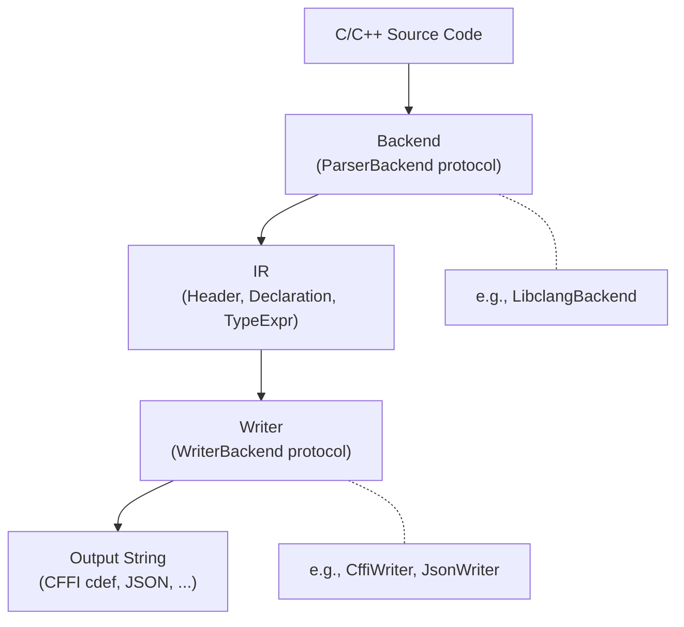
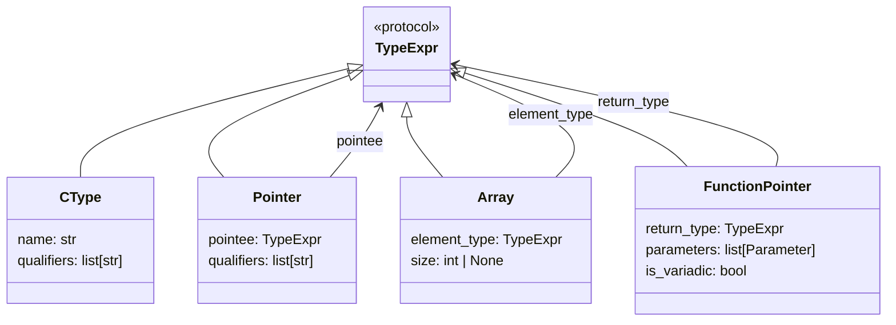
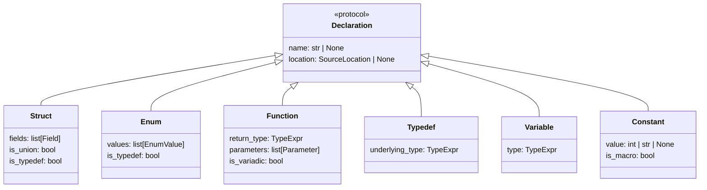

# Architecture Overview

headerkit is organized around a three-layer pipeline: **backends** parse C/C++ headers, producing an **IR** (Intermediate Representation), which **writers** consume to generate output.

## The Pipeline



Each layer is independent. Backends know nothing about writers. Writers know nothing about backends. The IR is the contract between them.

## Layer 1: Backends (Parsing)

A backend implements the [`ParserBackend`][headerkit.ir.ParserBackend] protocol and converts C/C++ source code into IR.

```python
from headerkit import ParserBackend
from headerkit.ir import Header

class ParserBackend(Protocol):
    def parse(
        self,
        code: str,
        filename: str,
        include_dirs: list[str] | None = None,
        extra_args: list[str] | None = None,
        *,
        use_default_includes: bool = True,
        recursive_includes: bool = True,
        max_depth: int = 10,
        project_prefixes: tuple[str, ...] | None = None,
    ) -> Header: ...

    @property
    def name(self) -> str: ...

    @property
    def supports_macros(self) -> bool: ...

    @property
    def supports_cpp(self) -> bool: ...
```

### Built-in Backend: LibclangBackend

The `LibclangBackend` uses LLVM's libclang to parse headers. It provides:

- Full C and C++ support (templates, namespaces, classes)
- Preprocessor handling (`#include`, `#define`, `#ifdef`)
- Source location tracking for error reporting
- Recursive include processing for umbrella headers

```python
from headerkit import get_backend

backend = get_backend("libclang")
header = backend.parse(code, "myheader.h")
```

### Backend Registry

Backends register themselves using `register_backend()`:

```python
from headerkit.backends import register_backend

register_backend("mybackend", MyBackendClass, is_default=False)
```

Registry functions:

| Function | Description |
|----------|-------------|
| `get_backend(name=None)` | Get a backend instance (default if `name` is `None`) |
| `list_backends()` | List all registered backend names |
| `is_backend_available(name)` | Check if a backend is registered |
| `register_backend(name, cls)` | Register a new backend |

See [Writing Custom Backends](custom-backends.md) for a complete guide.

## Layer 2: IR (Intermediate Representation)

The IR is a tree of Python dataclasses rooted at [`Header`][headerkit.ir.Header]. It is designed to be parser-agnostic: any backend that can parse C/C++ can produce the same IR.

### Type Expressions

Type expressions (`TypeExpr`) represent C types as composable trees:



| Class | Represents | Example |
|-------|-----------|---------|
| [`CType`][headerkit.ir.CType] | Base type with qualifiers | `int`, `const char`, `unsigned long` |
| [`Pointer`][headerkit.ir.Pointer] | Pointer to another type | `int*`, `const char*`, `void**` |
| [`Array`][headerkit.ir.Array] | Fixed or flexible array | `int[10]`, `char[]` |
| [`FunctionPointer`][headerkit.ir.FunctionPointer] | Function pointer | `void (*)(int, char*)` |

Types compose naturally:

```python
from headerkit import CType, Pointer, Array

# const char*
const_char_ptr = Pointer(CType("char", ["const"]))

# int**
int_ptr_ptr = Pointer(Pointer(CType("int")))

# const char*[]
string_array = Array(Pointer(CType("char", ["const"])))
```

### Declarations

Declarations (`Declaration`) represent top-level C/C++ constructs:



| Class | Represents |
|-------|-----------|
| [`Struct`][headerkit.ir.Struct] | Structs, unions, and C++ classes |
| [`Enum`][headerkit.ir.Enum] | Enumerations with named constants |
| [`Function`][headerkit.ir.Function] | Function prototypes |
| [`Typedef`][headerkit.ir.Typedef] | Type aliases |
| [`Variable`][headerkit.ir.Variable] | Global/extern variables |
| [`Constant`][headerkit.ir.Constant] | `#define` macros and `const` values |

### The Header Container

[`Header`][headerkit.ir.Header] is the top-level container returned by all backends:

```python
from headerkit.ir import Header

# Header fields:
#   path: str                        -- original file path
#   declarations: list[Declaration]  -- all extracted declarations
#   included_headers: set[str]       -- basenames of included headers
```

## Layer 3: Writers (Output)

A writer implements the [`WriterBackend`][headerkit.writers.WriterBackend] protocol and converts IR into a string output:

```python
from headerkit.writers import WriterBackend
from headerkit.ir import Header

class WriterBackend(Protocol):
    def write(self, header: Header) -> str: ...

    @property
    def name(self) -> str: ...

    @property
    def format_description(self) -> str: ...
```

Writer-specific options (e.g., `exclude_patterns` for CFFI, `indent` for JSON) are constructor parameters on the concrete class, not part of the `write()` method signature.

### Built-in Writers

| Writer | Output | Constructor Options |
|--------|--------|-------------------|
| [`CffiWriter`][headerkit.writers.cffi.CffiWriter] | CFFI `cdef` strings | `exclude_patterns: list[str] \| None` |
| [`JsonWriter`][headerkit.writers.json.JsonWriter] | JSON serialization | `indent: int \| None` |

### Writer Registry

Writers use the same registry pattern as backends:

```python
from headerkit.writers import register_writer

register_writer("mywriter", MyWriterClass, description="My custom output format")
```

Registry functions:

| Function | Description |
|----------|-------------|
| `get_writer(name=None, **kwargs)` | Get a writer instance; kwargs forwarded to constructor |
| `list_writers()` | List all registered writer names |
| `is_writer_available(name)` | Check if a writer is registered |
| `register_writer(name, cls)` | Register a new writer |
| `get_writer_info()` | Get metadata for all writers |

See [Writing Custom Writers](custom-writers.md) for a complete guide.

## Design Principles

**Parser-agnostic IR.** The IR does not leak backend-specific details. A `Struct` from libclang looks exactly the same as a `Struct` from any other backend. This means writers work identically regardless of which backend produced the IR.

**Composable types.** Type expressions are recursive dataclasses that mirror how C types actually compose. `const char**` is `Pointer(Pointer(CType("char", ["const"])))` -- no string parsing needed.

**Best-effort output.** Writers silently skip declarations they cannot represent rather than raising exceptions. This makes the pipeline robust against headers with exotic constructs.

**Self-registering plugins.** Both backends and writers register themselves at import time. Adding a new backend or writer requires zero changes to headerkit's core code. Just implement the protocol, call `register_backend()` or `register_writer()`, and your plugin is available through `get_backend()` or `get_writer()`.
