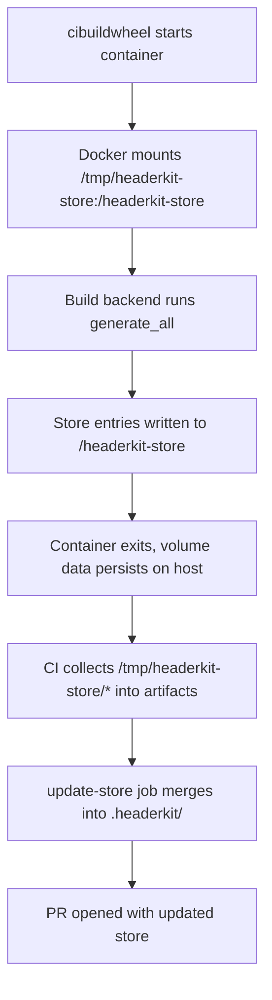

# cibuildwheel Integration

headerkit's store directory (`.headerkit/`) is populated during builds
and committed to version control so that downstream builds work without
libclang. When using [cibuildwheel](https://cibuildwheel.pypa.io/) on
Linux, the store needs special handling because of how cibuildwheel runs
Linux builds inside Docker containers.

## The problem

cibuildwheel uses three different strategies depending on platform:

| Platform | Strategy | Store behavior |
|----------|----------|----------------|
| **Linux** | Copies project into a Docker container | `.headerkit/` created inside container is **lost** when container exits |
| **macOS** | Builds directly on the host | `.headerkit/` persists normally |
| **Windows** | Builds directly on the host | `.headerkit/` persists normally |

On Linux, cibuildwheel copies the project directory into the container
and only copies built wheels back out. Any files created or modified
during the build -- including `.headerkit/` -- are discarded when the
container is removed.

This means Linux store entries are silently lost unless you take steps to
persist them.

## The solution: volume mount + `HEADERKIT_STORE_DIR`

cibuildwheel supports Docker volume mounts via `container-engine.create-args`.
By mounting a host directory into the container and pointing headerkit's
store at the mounted path, store entries survive container teardown.

Add this to your `pyproject.toml`:

```toml
[tool.headerkit]
store_dir = "${HEADERKIT_STORE_DIR}"

[tool.cibuildwheel.linux]
container-engine = { name = "docker", create-args = [
    "--volume", "/tmp/headerkit-store:/headerkit-store"
]}
environment = { HEADERKIT_STORE_DIR = "/headerkit-store" }
```

headerkit's config supports `${VAR}` environment variable expansion in
string values. When `store_dir` uses this syntax, the variable **must**
be set or headerkit will raise an error. The example workflow below sets
`HEADERKIT_STORE_DIR=.headerkit` as a job-level default for all
platforms, and cibuildwheel's Linux `environment` config overrides it
inside the container to point at the volume mount.

### Alternative: per-platform config

If you prefer not to set `HEADERKIT_STORE_DIR` on every platform, use
the CLI `--store-dir` flag in cibuildwheel's `before-all` hook instead
of the config file approach. `before-all` runs once per container
(rather than once per Python version), which is sufficient since header
generation is Python-version-independent:

```toml
[tool.cibuildwheel.linux]
container-engine = { name = "docker", create-args = [
    "--volume", "/tmp/headerkit-store:/headerkit-store"
]}
before-all = "pip install headerkit && headerkit --store-dir /headerkit-store {project}/include/*.h -w cffi"
```

## CI workflow pattern

The following GitHub Actions workflow builds wheels with cibuildwheel,
collects the store from all platforms, and opens a PR if anything
changed.

```yaml
name: Update headerkit store
on:
  push:
    branches: [main]
    paths:
      - "include/**/*.h"
      - "pyproject.toml"
  schedule:
    - cron: "0 6 * * 1"  # weekly on Monday

jobs:
  build:
    strategy:
      matrix:
        os: [ubuntu-latest, macos-latest, windows-latest]
    runs-on: ${{ matrix.os }}
    env:
      HEADERKIT_STORE_DIR: .headerkit
    steps:
      - uses: actions/checkout@v4

      - uses: actions/setup-python@v5
        with:
          python-version: "3.12"

      - name: Prepare store mount
        if: runner.os == 'Linux'
        run: mkdir -p /tmp/headerkit-store

      - name: Build wheels
        uses: pypa/cibuildwheel@v3

      - name: Collect headerkit store (Linux)
        if: runner.os == 'Linux'
        run: |
          mkdir -p .headerkit
          [ -d /tmp/headerkit-store ] && cp -rp /tmp/headerkit-store/. .headerkit/

      - name: Upload store
        uses: actions/upload-artifact@v4
        with:
          name: headerkit-store-${{ matrix.os }}
          path: .headerkit/

  update-store:
    needs: build
    runs-on: ubuntu-latest
    permissions:
      contents: write
      pull-requests: write
    steps:
      - uses: actions/checkout@v4

      - uses: actions/download-artifact@v4
        with:
          pattern: headerkit-store-*
          path: .headerkit/
          merge-multiple: true

      - uses: peter-evans/create-pull-request@v8
        with:
          commit-message: "chore: update headerkit store"
          title: "chore: update headerkit store"
          branch: headerkit/update-store
          body: |
            Automated update of `.headerkit/` store from CI matrix build.
          labels: automated
```

### How the workflow works

1. **Build job** runs cibuildwheel on each platform in parallel.
2. On **Linux**, the Docker volume mount persists store entries to
   `/tmp/headerkit-store` on the runner host. The "Collect" step copies
   these into `.headerkit/` so they are uploaded alongside any entries
   that were already present.
3. On **macOS and Windows**, the build happens directly on the host, so
   `.headerkit/` is populated in place with no extra steps.
4. Each platform uploads its store entries as artifacts.
5. **update-store** downloads all artifacts into a single `.headerkit/`
   directory and opens a PR if anything changed.

Once the store covers all target platforms, downstream `pip install`
builds never need libclang -- the build backend serves everything from
the committed store.

## How it works under the hood

The flow for a Linux cibuildwheel build:



For macOS and Windows, the flow is simpler: the build backend writes
directly to `.headerkit/` in the project directory, and the CI step
uploads it as-is.

## Troubleshooting

### Store not populated on Linux

**Symptom**: The Linux build artifact is empty or missing store entries.

**Check**: Verify `HEADERKIT_STORE_DIR` is set inside the container.
Add a debug step to your cibuildwheel config:

```toml
[tool.cibuildwheel.linux]
before-build = "echo HEADERKIT_STORE_DIR=$HEADERKIT_STORE_DIR && ls -la /headerkit-store/ 2>/dev/null || echo 'mount not found'"
```

**Common causes**:

- `container-engine.create-args` not set or misspelled.
- `HEADERKIT_STORE_DIR` not set in cibuildwheel's `environment`.
- The Docker volume path in `create-args` does not match the path in
  `HEADERKIT_STORE_DIR`.

### Container mount permissions

**Symptom**: Permission denied writing to `/headerkit-store` inside the
container.

**Fix**: Ensure the host directory exists and is writable before the
build starts. Add a `before-all` step:

```toml
[tool.cibuildwheel.linux]
before-all = "mkdir -p /headerkit-store && chmod 777 /headerkit-store"
```

Or create the host directory in your CI workflow before cibuildwheel
runs:

```yaml
- name: Prepare store mount
  if: runner.os == 'Linux'
  run: mkdir -p /tmp/headerkit-store
```

### macOS and Windows do not need special config

The volume mount and `HEADERKIT_STORE_DIR` settings are Linux-only.
macOS and Windows builds write to `.headerkit/` in the project directory
by default. Do not set `container-engine` options for non-Linux
platforms.

### Store entries not merged correctly

**Symptom**: The `update-store` job creates a PR but some platform
entries are missing.

**Check**: Verify the artifact upload includes the `.headerkit/` path
and that the Linux collect step ran successfully. The `merge-multiple: true`
option in `download-artifact` merges files from all matrix jobs into a
single directory.

## See also

- [CI Store Population](github-action.md) for the non-cibuildwheel
  workflow pattern.
- [Cache Strategy Guide](cache.md) for cache layout and bypass flags.
- [Build Backend Guide](build-backend.md) for using headerkit as a
  PEP 517 build backend.
